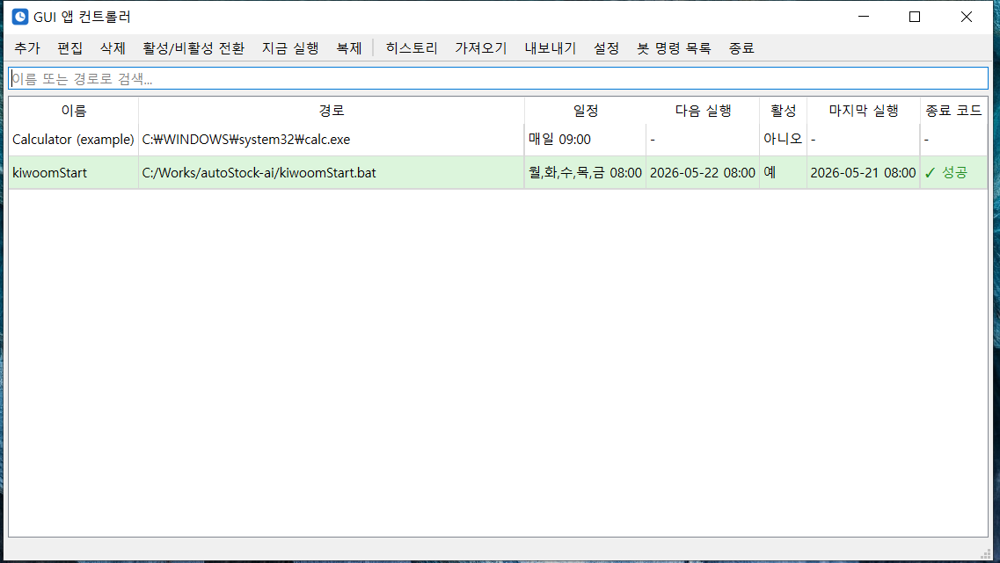

# 매일 같은 시간에 PC가 알아서 — GUI Apps Controller로 5분 만에 자동화하기

> 출근하자마자 키움증권을 띄우고, 매일 9시에 백업 스크립트를 돌리고, 새벽에는 PC를 잠그고 싶다. 그런데 Windows 작업 스케줄러는 너무 복잡하고, cron은 Linux 얘기다.

**GUI Apps Controller**는 이런 일을 위해 만들어졌습니다. 트레이에 상주하면서 등록한 프로그램을 지정한 시간에 자동 실행해 주는 작은 도구입니다. 설치 후 5분이면 첫 자동화를 만들 수 있습니다.

위 화면은 실제 사용 예시입니다. `kiwoomStart.bat`이 **월~금 08:00**에 자동 실행되도록 설정되어 있고, 오늘(05-21) 08:00에 성공적으로 동작한 기록이 보입니다. 다음 실행은 내일(05-22) 08:00 예정.

---

## 왜 만들었나

Windows 작업 스케줄러는 강력하지만 클릭이 너무 많이 필요합니다. 단순히 "월요일 아침마다 이 .bat 파일 실행"을 하려고 트리거 → 동작 → 조건 → 설정 4단계 마법사를 거쳐야 하고, 한번 만든 일정을 수정하려면 다시 그 미궁 속으로 들어가야 합니다.

GUI Apps Controller는 **딱 하나의 화면**에 모든 일정을 표로 보여주고, 클릭 두 번이면 추가·편집·삭제가 됩니다.

## 누구에게 좋은가

- **자동매매 / 알고리즘 트레이딩**: 장 시작 전 HTS, 시장 데이터 수집 스크립트, 봇 자동 기동
- **개발자**: 매일 아침 빌드 / 백업 / 로그 정리 스크립트 트리거
- **콘텐츠 / 디자이너**: 일정한 시간에 렌더링·동기화 작업 시작
- **누구나**: 영화 시간에 미디어 플레이어 자동 실행, 정해진 시각에 PC 자동 잠금 등 일상 자동화

## 다운로드 & 설치

[Releases 페이지](https://github.com/cflab2017/GUI_Apps_Controler/releases/latest)에서 **`GuiAppsController-Setup-X.Y.Z.exe`** 한 개만 받으면 됩니다.

- Windows 10 / 11 (64-bit)
- Python 같은 사전 설치 **불필요**
- 설치 → 시작 메뉴에서 실행 → 트레이 아이콘이 뜨면 끝

---

## 5분 만에 첫 자동화 만들기

스크린샷의 `kiwoomStart`처럼 매일 오전 8시에 배치 파일을 실행하도록 만들어 봅니다.

### 1단계 — 추가 클릭
툴바의 **[추가]** 또는 `Ctrl+N`을 누르면 편집 다이얼로그가 열립니다.

### 2단계 — 프로그램 정보 입력
- **이름**: 알아볼 수 있는 라벨 (`kiwoomStart`)
- **경로**: `[찾아보기]` 버튼으로 `.exe` / `.bat` / `.cmd` 선택
- **인자**: 필요하면 명령줄 인자 (옵션)
- **작업 폴더**: 비워두면 실행 파일과 같은 폴더 사용

### 3단계 — 일정 설정
- **매일**: 매일 같은 시간 (예: 매일 09:00)
- **매주**: 요일 선택 — 월·화·수·목·금만 체크하면 평일 출근 자동화
- **한 번**: 특정 일시 1회 (배포 일정 알림 등)

### 4단계 — 저장
**[확인]**을 누르면 표에 항목이 추가됩니다. 이때 표의 "다음 실행" 컬럼에 **APScheduler가 계산한 실제 다음 실행 시각**이 표시되므로 일정이 의도대로 잡혔는지 한눈에 확인할 수 있습니다.

### 5단계 — 검증
새로 만든 항목을 선택하고 **[지금 실행]** (`Ctrl+R`)을 누르면 일정과 무관하게 즉시 실행됩니다. 등록 직후 "내 .bat 파일이 잘 도는가?"를 확인하는 가장 빠른 방법.

> 💡 표에서 **활성된 행은 옅은 녹색**으로 강조되고, **만료된 1회 일정은 옅은 빨강**으로 표시됩니다. 한눈에 어떤 게 살아있는지 보입니다.

---

## 일상 사용 팁

### 검색으로 빠르게 찾기
표 상단 검색창에 이름이나 경로 일부를 입력하면 즉시 필터링됩니다. 등록 프로그램이 30개를 넘어가도 쾌적합니다.

### 다중 선택 + 일괄 작업
`Ctrl`+클릭 / `Shift`+클릭으로 여러 항목을 선택한 뒤:
- **활성/비활성 토글**: 휴가 동안 전부 일시 정지
- **삭제**: 더 이상 안 쓰는 항목 한 번에 정리
- **복제** (`Ctrl+D`): 비슷한 설정을 여러 개 만들 때 시간 절약

### 히스토리 (`Ctrl+H`)
"어제 새벽 3시에 진짜 실행됐을까?" — 히스토리 창이 답을 줍니다. 최근 500개의 launch/exit/실패 이벤트가 영구 저장됩니다. 종료 코드 컬러 강조(녹색=성공, 빨강=실패)로 무엇이 정상이고 무엇이 아닌지 즉각 보입니다.

### 가져오기 / 내보내기
**[내보내기]**로 JSON 파일을 만들어 두면, 다른 PC에서 **[가져오기]**로 한 번에 모든 일정을 복원할 수 있습니다. PC 교체나 사무실/집 환경 동기화에 유용합니다.

### Telegram 봇 — 외부에서도 제어
v1.5.x부터는 텔레그램 봇으로 외부에서 PC를 제어할 수 있습니다. 설정에서 봇 토큰과 chat_id를 등록하면:
- `/list` — 등록된 프로그램 보기
- `/run <이름>` — 원격 실행
- `/screenshot` — PC 화면 캡쳐 받기
- `/lock`, `/shutdown`, `/restart` — PC 잠금/종료/재시작
- `/history` — 최근 실행 내역 확인

회사에서 집 PC의 자동매매가 잘 돌고 있는지 확인하고 싶을 때, 휴대폰 텔레그램만 열면 됩니다.

### 절전 후에도 안전
노트북을 닫았다가 다시 열어도 일정은 정상 동작합니다. Windows 절전/재개 이벤트를 감지해 스케줄러가 자동으로 재계산하기 때문입니다. APScheduler 단독 사용 시 흔히 발생하는 "절전 후 다음 실행이 빗나가는" 문제가 없습니다.

### 다크 모드
시스템 테마를 다크로 바꾸면 표 배경과 강조 색상이 자동으로 어두운 톤으로 전환됩니다.

---

## 자주 묻는 질문

**Q. 프로그램이 안 떴어요. 왜인지 알 수 있나요?**
`%APPDATA%\GuiAppsController\logs\app.log`에 모든 launch/exit 이벤트가 기록됩니다. 회전 핸들러(2MB × 5개 보존)로 디스크를 채우지도 않습니다. 히스토리 창에서도 같은 정보를 GUI로 볼 수 있습니다.

**Q. PC를 끄면 그 시간대 일정은요?**
PC가 꺼져 있던 시간대의 일정은 건너뜁니다 (APScheduler 기본). 다음 일정부터 정상 동작합니다.

**Q. 1회 일정인데 시간이 이미 지났어요.**
표에서 "(만료됨)" 라벨과 함께 옅은 빨강 배경으로 표시됩니다. 편집해서 미래 시각으로 변경하고 저장하면 다시 정상 등록됩니다.

**Q. Windows 시작 시 자동 실행 되게 하려면?**
설정에서 "Windows 시작 시 자동 실행"을 체크하면 됩니다. `HKCU\...\Run`에 등록되어 관리자 권한 없이도 동작합니다.

**Q. 동시 저장으로 설정이 깨질 수 있나요?**
v1.0.3부터 저장 시 `fsync` + atomic replace + JSON 사전 검증을 거치므로 갑작스러운 전원 차단에서도 `config.json`이 깨지지 않습니다. 깨졌더라도 `.bak`에서 자동 복구합니다.

---

## 마무리

복잡한 일을 단순하게 만드는 도구입니다. 매일 손으로 반복하던 일이 있다면 한번 등록해 보세요. 첫 자동화 등록까지 정말 5분이면 충분합니다.

- **다운로드**: [GitHub Releases](https://github.com/cflab2017/GUI_Apps_Controler/releases/latest)
- **소스 / 이슈 / 기능 제안**: [github.com/cflab2017/GUI_Apps_Controler](https://github.com/cflab2017/GUI_Apps_Controler)
- **라이선스**: 자유롭게 사용 가능

피드백과 별표(⭐)는 언제나 환영입니다.
