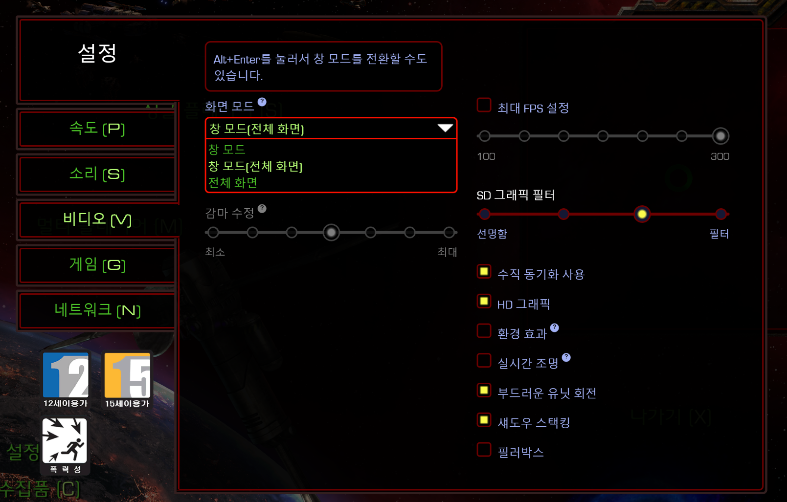
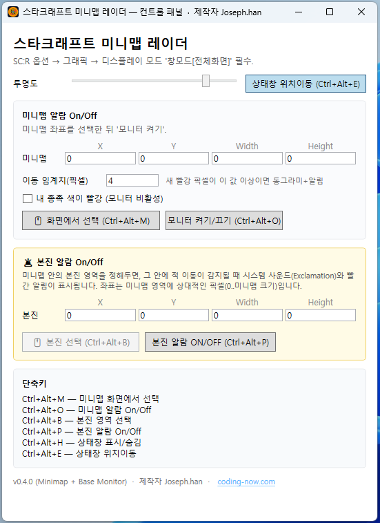
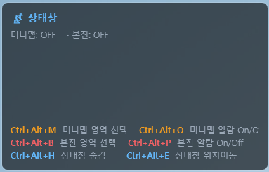
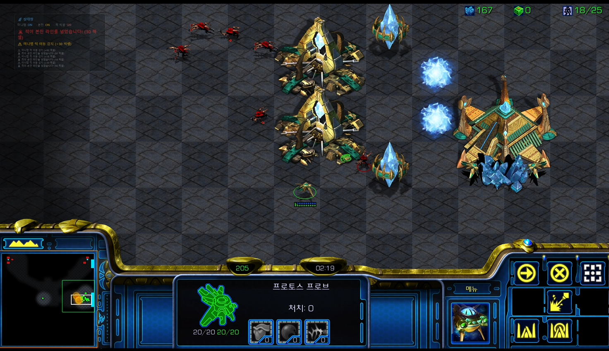
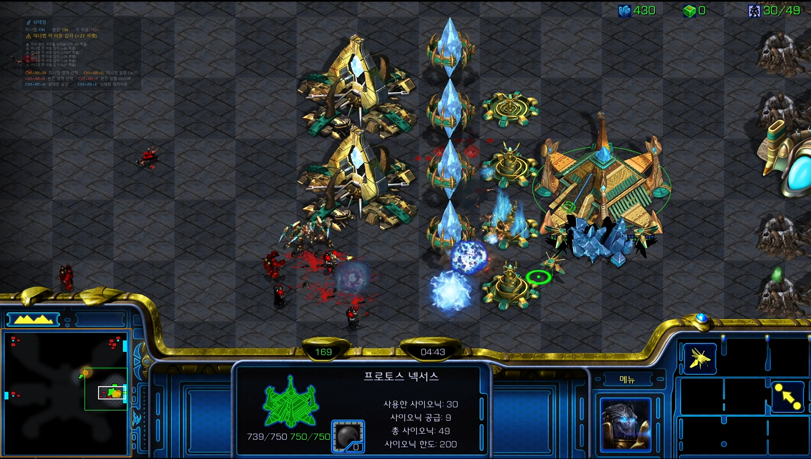
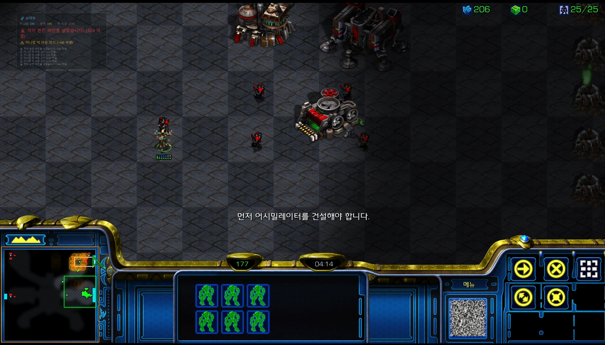
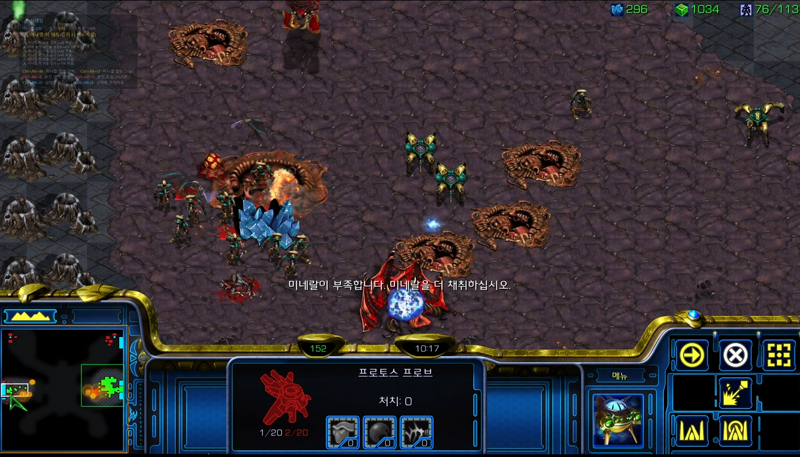

> 제작자 **Joseph.han** · [coding-now.com](https://coding-now.com)
> 다운로드: [최신 Release (Portable zip)](https://github.com/cflab2017/StarCraftMinimapRadar/releases) · 압축 풀고 .exe만 실행하면 끝
> 깃허브: [cflab2017/StarCraftMinimapRadar](https://github.com/cflab2017/StarCraftMinimapRadar)

## 미니맵, 매번 놓치셨죠?

손은 본진에서 빌드 올리고, 시선은 교전에 가 있고, 그러는 사이 적의 정찰병 한 기가 노란 길 따라 살짝 들어왔다 나갑니다. 다음 견제는 어디로 올지 안 봐도 뻔하죠.

**스타크래프트 미니맵 레이더**는 미니맵의 빨간 픽셀(=적)만 골라서 지켜봅니다. 적의 새로운 움직임이 잡히면 화면 한 켠 상태창에 즉시 표시하고, 미리 지정해둔 **본진 영역**을 빨강이 침범하는 순간 시스템 사운드와 빨간 펄스로 경고합니다.

게임 메모리나 D3D에 일절 손대지 않습니다. 그냥 **내 화면의 미니맵 영역만 캡처**해서 분석하는 방식이라 EULA 위반 위험이 없고, OBS 화면 공유와 동일 수준의 안전한 동작입니다.

---

## 1단계 (필수) — SC:R을 "창모드[전체화면]"로

오버레이는 게임 위에 떠 있어야 하므로 전체화면(Fullscreen) 모드에서는 동작하지 않습니다. 게임 안에서 **옵션 → 비디오(V) → 디스플레이 모드**를 **창모드[전체화면]**으로 바꿔주세요.

> 게임 중에 **Alt+Enter**를 눌러도 창 모드로 전환됩니다.
> 한 번만 설정해두면 다음부터는 그대로 유지됩니다.

---

## 2단계 — 앱 받아서 실행

[Releases 페이지](https://github.com/cflab2017/StarCraftMinimapRadar/releases)에서 `StarCraftMinimapRadar-x.y.z-portable-x64.zip` 받고 **압축만 풀면** 됩니다. 설치 과정 없고, .NET 런타임도 exe 안에 포함되어 있어 의존성도 없습니다.

> Windows SmartScreen이 처음 한 번 경고를 띄울 수 있습니다. (자체 서명한 무료 도구라 그렇습니다.) **추가 정보 → 실행**으로 넘어가시면 됩니다.

실행하면 컨트롤 패널이 뜹니다:

다음 3가지만 하면 준비 끝입니다:

1. **🖱 화면에서 선택 (Ctrl+Alt+M)** — 게임 화면이 떠 있는 상태에서 클릭하고, 미니맵 영역을 마우스로 드래그한 뒤 **Enter** 누르면 자동으로 좌표가 잡힙니다.
2. **🖱 본진 선택 (Ctrl+Alt+B)** — 미니맵 안에서 내 본진(스타팅 베이스) 영역을 한 번 더 드래그. 이 안에 적이 들어오면 본진 알람이 울립니다.
3. 좌표가 잡히면 모니터는 **자동으로 켜집니다**. 매번 다시 토글할 필요 없어요.

> 다음 실행부터는 좌표·모니터 ON 상태가 그대로 복원되니, **한 번만 잡아두면 됩니다.**

---

## 3단계 — 상태창을 게임 옆에 두기

게임 화면을 가리지 않는 클릭 통과(click-through) 오버레이입니다. 마우스도, 키보드도 그냥 게임으로 다 빠져나갑니다.

상태창에서 항상 보이는 정보:

- **미니맵 ON/OFF** — 모니터링 중인지
- **본진 ON/OFF** — 본진 알람 활성화 여부
- **적 픽셀: NN** — 현재 미니맵 안의 빨간 픽셀 총량 (적이 새로 등장하면 숫자가 튀어오릅니다)
- **하단 6개 단축키** — 외울 필요 없이 항상 보입니다

상태창 위치를 옮기고 싶다면 **Ctrl+Alt+E**로 위치이동 모드를 켜고 드래그. 다시 한 번 누르면 잠깁니다.

---

## 실전 시나리오 1 — 초반 정찰 잡아내기

게임 시작 약 2분, 상대 정찰병이 노란 길로 진입합니다. 시선은 본진 가스 짓느라 정신없는 와중에...

오버레이가 미니맵에서 **새로 등장한 빨강 픽셀**을 감지해 상태창에 `⚠ 미니맵 적 이동 감지 (+N 픽셀)`을 띄웁니다. 화면 위 미니맵 영역에는 **주황 점선** 추적 사각형이 떠 있어, 내가 지금 어느 영역을 감시하고 있는지 한눈에 확인됩니다.

**민감도 조절**: 컨트롤 패널 → "공통 설정" → 이동 임계치 콤보
- **매우 민감 (2 px)** — 정찰 1기도 잡음
- **표준 (4 px)** ← 권장
- **부대 단위만 (10 px)** — 큰 무리만 알림

---

## 실전 시나리오 2 — 본진 라인을 적이 넘었다!

본진 알람은 단순한 "적 감지"가 아닙니다. **본진 영역 안으로 적이 들어온 그 순간** 한 번만 울리고, 적이 빠져나간 뒤 다시 들어오면 다시 울립니다 (히스테리시스 처리). 같은 곳에 머무는 적 때문에 알람이 계속 울려대는 일이 없습니다.

본진 라인을 넘는 순간:
- 시스템 사운드 **Exclamation**이 울리고
- 상태창에 큰 빨간 글씨로 `🚨 적이 본진 라인을 넘었습니다! (N 픽셀)`
- 게임 화면 위 본진 영역이 **빨갛게 펄스**

가스 짓다가 견제 들어온 거 늦게 알아채는 일 없습니다.

---

## 실전 시나리오 3 — 멀티/견제 압박 동시 다발

게임 중반, 적이 멀티에 견제 보내고 본진에도 동시에 압박을 거는 상황. 미니맵 곳곳에서 빨강이 새로 등장합니다. 오버레이는 **각 위치를 클러스터링해 묶어서 알림**을 보내고, 상태창 하단 알람 로그에는 최근 6개의 알람이 누적되어 표시됩니다.

이 상태에서 **검출 감도** (공통 설정 → 검출 감도 콤보)를 조절하면 잔재 깜빡임을 거를지 vs 1픽셀이라도 잡을지 균형을 정할 수 있습니다:

- **민감** — 잔재 깜빡임 일부 허용 (놓치기 싫을 때)
- **표준** ← 권장
- **보수적** — 정적 패턴 강력 차단 (오작동 적게)

> 픽셀별 presence tracker가 "안 움직이는 정적 패턴"(건물 잔재, 폭발 잔영 등)을 자동으로 학습해서 차단하므로, 표준 설정으로도 정찰 후 남은 건물 잔재가 깜빡여서 알람이 잘못 울리는 일이 거의 없습니다.

---

## 단축키 한 번에

| 단축키 | 기능 |
|---|---|
| **Ctrl+Alt+M** | 미니맵 영역 선택 (드래그 + Enter) |
| **Ctrl+Alt+B** | 본진 영역 선택 |
| **Ctrl+Alt+O** | 미니맵 알람 ON/OFF |
| **Ctrl+Alt+P** | 본진 알람 ON/OFF |
| **Ctrl+Alt+H** | 상태창 표시/숨김 |
| **Ctrl+Alt+E** | 상태창 위치이동 모드 |

게임 중 손을 키보드에서 떼지 않고도 알람을 잠시 끄거나 영역을 다시 잡을 수 있게 설계했습니다.

---

## ⚠ 주의사항

**내 종족 색이 빨강이면 못 씁니다.** SC:R 미니맵에서 적은 항상 빨강으로 표시되는데, 본인이 빨강 슬롯이면 자기 유닛도 빨강이라 적과 구분이 안 됩니다. 컨트롤 패널의 **"내 플레이어 슬롯 색이 빨강일 때 체크"**를 켜두면 모니터가 자동으로 차단되어 오작동을 막아줍니다.

대부분의 1v1 래더는 1P가 빨강이 아닌 슬롯에 배정되므로 문제없지만, 캠페인이나 커스텀 게임에서는 신경 써주세요.

---

## ❤️ 무료 + 오픈소스 + 게임에 손대지 않음

- **무료** — Portable zip 받아서 실행하면 끝. 광고도 결제도 없습니다.
- **EULA 안전** — 게임 프로세스에 접근하지 않습니다. 자기 화면 픽셀만 봅니다.
- **오픈소스 (MIT)** — [깃허브](https://github.com/cflab2017/StarCraftMinimapRadar)에서 전체 코드 확인 가능
- **한국어 / English 두 언어 지원** — 컨트롤 패널 우상단에서 즉시 전환

만들면서 즐거웠고, 사용자분께서도 한 판이라도 더 편하게 즐기시면 좋겠습니다. 버그나 제안은 [GitHub Issues](https://github.com/cflab2017/StarCraftMinimapRadar/issues)로 알려주시면 빠르게 반영하겠습니다.

좋은 경기 되세요. 🛡️

---

> 📥 [최신 Portable zip 받기](https://github.com/cflab2017/StarCraftMinimapRadar/releases)
> 📖 [전체 사용자 가이드 · 개발 노트 시리즈](index.md)
> 💬 제작자 블로그: [coding-now.com](https://coding-now.com)
